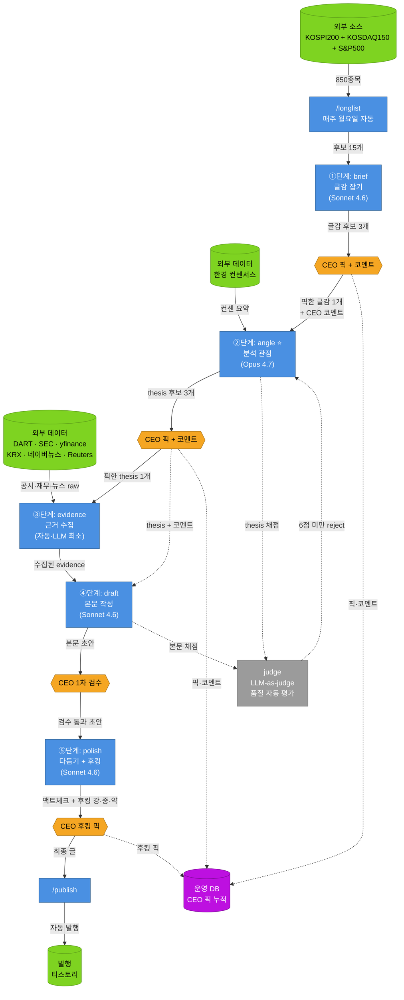
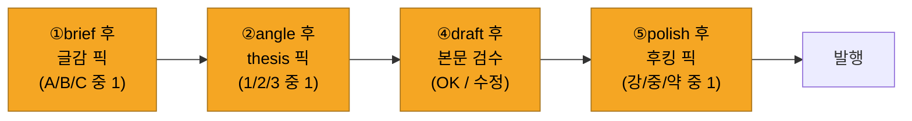

# GapFinder — 5단계 시스템 구조

> 작성일: 2026-05-05
> 목적: CEO·CTO·Claude 공통 멘탈 모델 정렬용 시각 자료
>
> **5단계 파이프라인 정의 출처:**
> - CEO 방향성 원문: [`board/requests/20260505_블로그운영시스템_보고서.md`](./board/requests/20260505_블로그운영시스템_보고서.md)
> - CTO 액션플랜: [`board/docs/20260505_CTO_액션플랜_v2.md`](./board/docs/20260505_CTO_액션플랜_v2.md)

---

## 1. 전체 시스템 흐름

**색깔 의미**
- 🟦 파랑 = 시스템 단계 (자동 처리)
- 🟧 주황 = CEO 결정 지점 (사람 개입)
- 🟩 초록 = 외부 데이터/발행 채널
- 🟪 보라 = 데이터 저장
- ⚪ 회색 = 사이드 시스템 (자동 평가)

---

## 2. 각 단계 Input/Output 표

| 단계 | Input | 처리 | Output |
|------|-------|------|--------|
| **/longlist** (사전) | universe 850종목, 5개 trigger 필터 (가격·EPS·뉴스·재무이상치 등) | 자동 산출 | **후보 15개 리스트** |
| **①brief** (글감) | longlist 15개 + (선택) CEO 직접 input | LLM 분류·정리 (Sonnet 4.6) | **글감 후보 3개** (종목 분석/산업 구조/통념 비판) |
| **②angle** ⭐ | ①의 픽 1개 + CEO 코멘트 + 컨센 요약 | **시장 view 반박** thesis 생성 (Opus 4.7) | **thesis 후보 3개** |
| **③evidence** | ②의 픽 1개 (thesis) | 외부 API 자동 호출 (DART/yfinance/뉴스 등) | **수집 데이터 묶음** (공시·재무·뉴스·컨센) |
| **④draft** | ①+②+③ 누적 | LLM 본문 작성 (Sonnet 4.6) | **본문 초안** (마크다운) |
| **⑤polish** | ④의 초안 | 팩트체크 + 후킹 변형 (Sonnet 4.6) | **팩트체크 결과** + **후킹 강·중·약 3개** |
| **/publish** | ⑤의 픽 | 티스토리 OAuth | 발행된 글 (URL) |

---

## 3. CEO가 1편당 마주치는 결정 포인트 4개

각 결정에 30초~2분, **총 5~10분/편.**

---

## 4. 핵심 포인트 3가지

### ① CEO 개입은 4번뿐
- ①brief 픽 / ②angle 픽 / ④draft 검수 / ⑤polish 픽
- ③evidence는 완전 자동, CEO 개입 없음

### ② 단계 사이의 데이터 흐름
- 각 단계 output이 다음 단계 input
- ②의 픽한 thesis는 ③·④·⑤ 모두에 영향 (글의 일관성 유지)
- CEO 코멘트는 다음 단계 prompt에 자동 inject

### ③ 사이드 시스템 2개
- **judge** (자동 평가): 6점 미만이면 재생성
- **운영 DB**: CEO 픽 데이터 누적 → 100편+ 후 자동 학습 input
